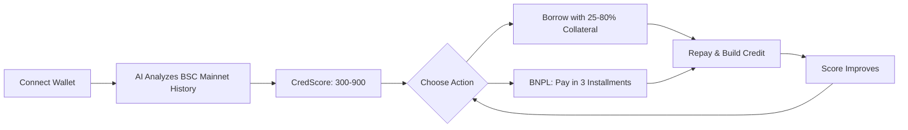
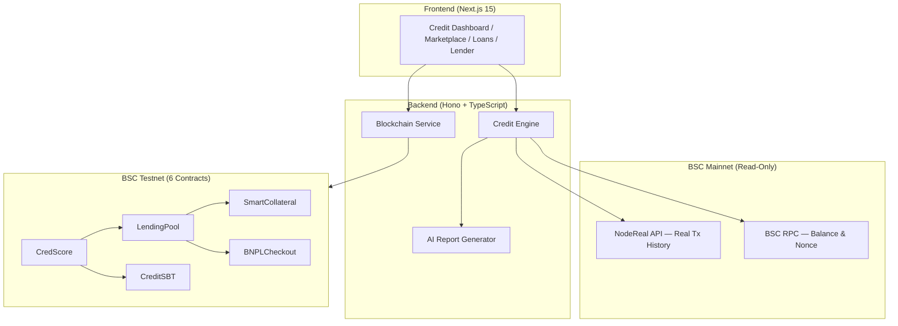

# CredShield

**AI-Powered Undercollateralized Lending & BNPL Protocol on BNB Chain**

> Built for [BNB Chain x YZi Labs Hack Series: Bengaluru](https://www.bnbchain.org/en/hackathon) (Feb 27-28, 2026)
> Track: **Smart Collateral for Web3 Credit & BNPL**

---

## The Problem

**1.4 billion unbanked people** have crypto wallets but zero credit history. In DeFi today:

- Borrowing $100 requires locking **$150+ in collateral** (Aave, Venus, Compound)
- **No on-chain credit scoring** exists — every user is treated identically
- **No BNPL** for Web3 commerce — Buy Now Pay Later doesn't exist on-chain
- **Billions locked** as overcollateral, unable to participate in the broader economy

## The Solution

CredShield uses **AI to analyze real BSC mainnet transaction history** and generate an on-chain credit score (300-900) that determines borrowing power. Users with strong on-chain history borrow with **as low as 25% collateral** — vs. the standard 150%+ in DeFi.



## Key Features

| Feature | Description |
|---------|-------------|
| **AI Credit Scoring** | Analyzes real BSC mainnet tx history across 6 dimensions via OpenRouter AI |
| **Undercollateralized Lending** | Borrow with 25-80% collateral based on your CredScore tier |
| **Smart Collateral** | Collateral earns 8% APR yield while backing your loan |
| **BNPL Checkout** | Pay-in-3 installments, merchant receives full payment instantly |
| **Soulbound Credit Tokens** | Non-transferable ERC-721 tokens building on-chain credit reputation |
| **Credit Tiers** | Bronze / Silver / Gold / Platinum with progressive benefits |

## Credit Tiers

| Tier | Score | Collateral | Credit Limit | Interest |
|------|-------|-----------|--------------|----------|
| Bronze | 300-499 | 80% | $500 | 15% APR |
| Silver | 500-649 | 60% | $2,000 | 10% APR |
| Gold | 650-799 | 40% | $10,000 | 7% APR |
| Platinum | 800-900 | 25% | $50,000 | 5% APR |

## Architecture

Credit scoring reads **real data from BSC Mainnet**. Lending contracts execute on **BSC Testnet**.



> Full architecture, data flows, and sequence diagrams in [`docs/TECHNICAL.md`](./docs/TECHNICAL.md)

## Deployed Contracts (BSC Testnet)

| Contract | Address | Purpose |
|----------|---------|---------|
| MockUSDT | [`0xf10BDa04E2a5ff41329Edc0d9BA8a7e52956A27D`](https://testnet.bscscan.com/address/0xf10BDa04E2a5ff41329Edc0d9BA8a7e52956A27D) | Test stablecoin |
| CredScore | [`0x6aB8B76ab4a7db790F64adE917e8029F6515e076`](https://testnet.bscscan.com/address/0x6aB8B76ab4a7db790F64adE917e8029F6515e076) | On-chain credit registry |
| LendingPool | [`0x73bebEd5658B3d6d2f341035e9aA0124C7AB3f2c`](https://testnet.bscscan.com/address/0x73bebEd5658B3d6d2f341035e9aA0124C7AB3f2c) | Core lending engine |
| SmartCollateral | [`0xaAdc99b3928898D692C59f165f6f5D3D9605affF`](https://testnet.bscscan.com/address/0xaAdc99b3928898D692C59f165f6f5D3D9605affF) | Yield-earning collateral vault |
| CreditSBT | [`0xAAA1930451fDA7c569E844a6CbE93D2B793d8103`](https://testnet.bscscan.com/address/0xAAA1930451fDA7c569E844a6CbE93D2B793d8103) | Soulbound credit token |
| BNPLCheckout | [`0xE0CF917AA5463d29158EcE406BeD6D9D8EC16af8`](https://testnet.bscscan.com/address/0xE0CF917AA5463d29158EcE406BeD6D9D8EC16af8) | BNPL installment manager |

> Also available in [`bsc.address`](./bsc.address) (JSON format for easy verification)

## Quick Start

```bash
# Option 1: Docker (recommended)
docker-compose up

# Option 2: Manual
# 1. Install dependencies
npm install                    # Contract dependencies
cd backend && npm install      # Backend
cd ../frontend && npm install  # Frontend

# 2. Configure environment
cp backend/.env.example backend/.env
# Add your OPENROUTER_API_KEY to backend/.env

# 3. Run
cd backend && npm run dev      # http://localhost:3001
cd frontend && npm run dev     # http://localhost:3000

# 4. Run tests (35/35 passing)
npm test
```

## Scoring Dimensions

| Dimension | Weight | Measures |
|-----------|--------|----------|
| Wallet Maturity | 20% | Wallet age, activity consistency, transaction volume |
| DeFi Experience | 25% | Protocol diversity, lending/LP/staking activity |
| Transaction Quality | 20% | Success rate, audited protocol usage, contract diversity |
| Asset Health | 15% | BNB balance, token diversity, stablecoin/blue-chip holdings |
| Repayment History | 15% | Lending repayments, recurring transaction partners |
| Social Verification | 5% | NFT/domain activity, governance participation, bridge usage |

## Tech Stack

| Layer | Technology |
|-------|-----------|
| Smart Contracts | Solidity 0.8.24, OpenZeppelin, Hardhat |
| Backend | Hono, TypeScript, viem, OpenRouter AI |
| Frontend | Next.js 15, React 19, TailwindCSS, shadcn/ui, wagmi v2, RainbowKit, Recharts |
| Data | NodeReal API (BSC mainnet tx history), BSC RPC |
| Infra | Docker, BSC Testnet (Chain ID: 97) |

## Project Structure

```
credshield/
├── contracts/              # 6 Solidity smart contracts
├── backend/                # Hono + TypeScript API (credit engine, AI reports)
├── frontend/               # Next.js 15 dashboard (4 pages)
├── test/                   # 35 contract tests (Hardhat + Chai)
├── docs/
│   ├── PROJECT.md          # Problem, solution, impact, roadmap
│   ├── TECHNICAL.md        # Architecture, setup, demo guide
│   └── EXTRAS.md           # Demo video & presentation links
├── scripts/deploy.js       # BSC Testnet deployment + wiring
├── bsc.address             # Deployed contract addresses (JSON)
├── docker-compose.yml      # One-command setup
├── LICENSE                 # MIT
└── hardhat.config.js
```

## Documentation

| Document | Content |
|----------|---------|
| [`docs/PROJECT.md`](./docs/PROJECT.md) | Problem statement, solution, user journey (Mermaid), business model, roadmap |
| [`docs/TECHNICAL.md`](./docs/TECHNICAL.md) | System architecture, setup instructions, demo guide |
| [`docs/EXTRAS.md`](./docs/EXTRAS.md) | Demo video & presentation links |
| [`ARCHITECTURE.md`](./ARCHITECTURE.md) | Detailed ASCII architecture diagrams and data flows |
| [`bsc.address`](./bsc.address) | All deployed contract addresses with explorer links |

## License

[MIT](./LICENSE)

---

Built for **BNB Chain x YZi Labs Hack Series: Bengaluru** (Feb 27-28, 2026) | Track: Smart Collateral for Web3 Credit & BNPL

[@BNBChain](https://twitter.com/BNBChain) #BNBHack
