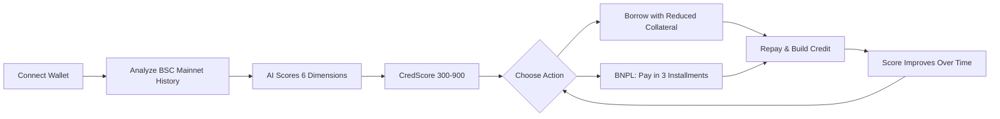
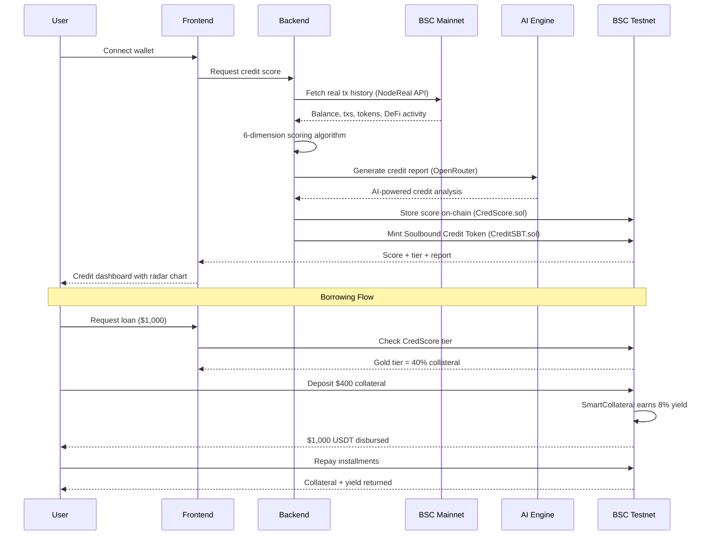

# CredShield — Problem, Solution & Impact

## 1. Problem

**1.4 billion unbanked people** have crypto wallets but zero traditional credit history. In DeFi today:

- **Overcollateralization is the norm** — borrowing $100 requires locking $150+ in collateral (Aave, Venus, Compound all require 130-200%)
- **No credit scoring exists on-chain** — every user is treated the same regardless of their transaction history
- **No BNPL in Web3** — traditional Buy Now Pay Later doesn't exist for on-chain commerce
- **Capital inefficiency** — billions in crypto locked as overcollateral, unable to participate in the broader economy

This creates a **credit desert** where users with years of responsible DeFi activity still can't access undercollateralized loans.

## 2. Solution

CredShield bridges the gap between on-chain history and credit access using **AI-powered credit scoring**.

### How It Works



### User Journey



### Key Features

| Feature | Description |
|---------|-------------|
| **AI Credit Scoring** | Analyzes real BSC mainnet tx history across 6 dimensions using AI |
| **Undercollateralized Lending** | Borrow with 25-80% collateral based on CredScore tier |
| **Smart Collateral** | Your collateral earns 8% APR yield while backing your loan |
| **BNPL Checkout** | Pay-in-3 installments for on-chain purchases, merchant paid instantly |
| **Soulbound Credit Tokens** | Non-transferable ERC-721 tokens that build on-chain credit reputation |
| **Credit Building** | Every repayment improves your score, unlocking better terms |

### Credit Tiers

| Tier | Score | Collateral | Credit Limit | Interest Rate |
|------|-------|-----------|--------------|---------------|
| Bronze | 300-499 | 80% | $500 | 15% APR |
| Silver | 500-649 | 60% | $2,000 | 10% APR |
| Gold | 650-799 | 40% | $10,000 | 7% APR |
| Platinum | 800-900 | 25% | $50,000 | 5% APR |

## 3. Business & Ecosystem Impact

### Target Users

1. **Crypto-native users** — DeFi veterans with strong on-chain history who want to unlock capital without overcollateralizing
2. **Emerging market users** — Unbanked individuals with crypto wallets who need access to credit
3. **Merchants** — On-chain businesses that want to offer BNPL payment options
4. **Lenders** — Yield seekers who want to earn by providing liquidity to the lending pool

### BNB Chain Ecosystem Value

- **First undercollateralized lending protocol on BSC** — fills a gap no existing protocol addresses
- **Increases BSC TVL** — lenders deposit into pools, borrowers lock smart collateral
- **Drives BSC mainnet usage** — credit scores incentivize on-chain activity (more txs = better score)
- **Composable** — CredScore can be read by any protocol for credit-gated features

### Monetization

- **Interest spread** — Protocol takes a margin between lender APY and borrower interest rate
- **BNPL merchant fees** — Small fee on each BNPL purchase processed
- **Premium credit reports** — Detailed AI analysis available as a paid feature

## 4. Limitations & Future Work

### Current Limitations

- Credit scoring currently limited to BSC mainnet history (single chain)
- Collateral yield is simulated (8% APR) rather than from real DeFi yield
- One active loan per borrower (simplified model)
- No liquidation bot for defaulted positions yet

### Roadmap

```mermaid
gantt
    title CredShield Roadmap
    dateFormat YYYY-Q
    section Phase 1 - MVP
    Core contracts + scoring      :done, 2026-Q1, 2026-Q1
    AI credit reports             :done, 2026-Q1, 2026-Q1
    Frontend dashboard            :done, 2026-Q1, 2026-Q1
    section Phase 2 - Enhancement
    Chainlink price feeds         :2026-Q2, 2026-Q2
    Venus Protocol yield          :2026-Q2, 2026-Q2
    Liquidation bot               :2026-Q2, 2026-Q3
    section Phase 3 - Expansion
    Multi-chain scoring           :2026-Q3, 2026-Q4
    ZK credit proofs              :2026-Q3, 2026-Q4
    Governance token              :2026-Q4, 2026-Q4
```

- **Chainlink price feeds** for dynamic collateral valuation
- **Venus Protocol** integration for real yield on collateral
- **Multi-chain scoring** — aggregate credit from Ethereum, Polygon, Arbitrum
- **ZK proofs** for privacy-preserving credit verification
- **Governance token** for protocol parameter voting
- **opBNB** integration for cheaper BNPL micro-transactions
