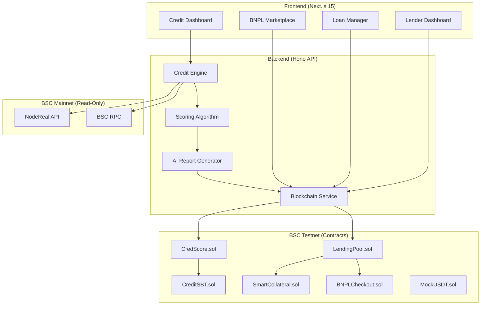
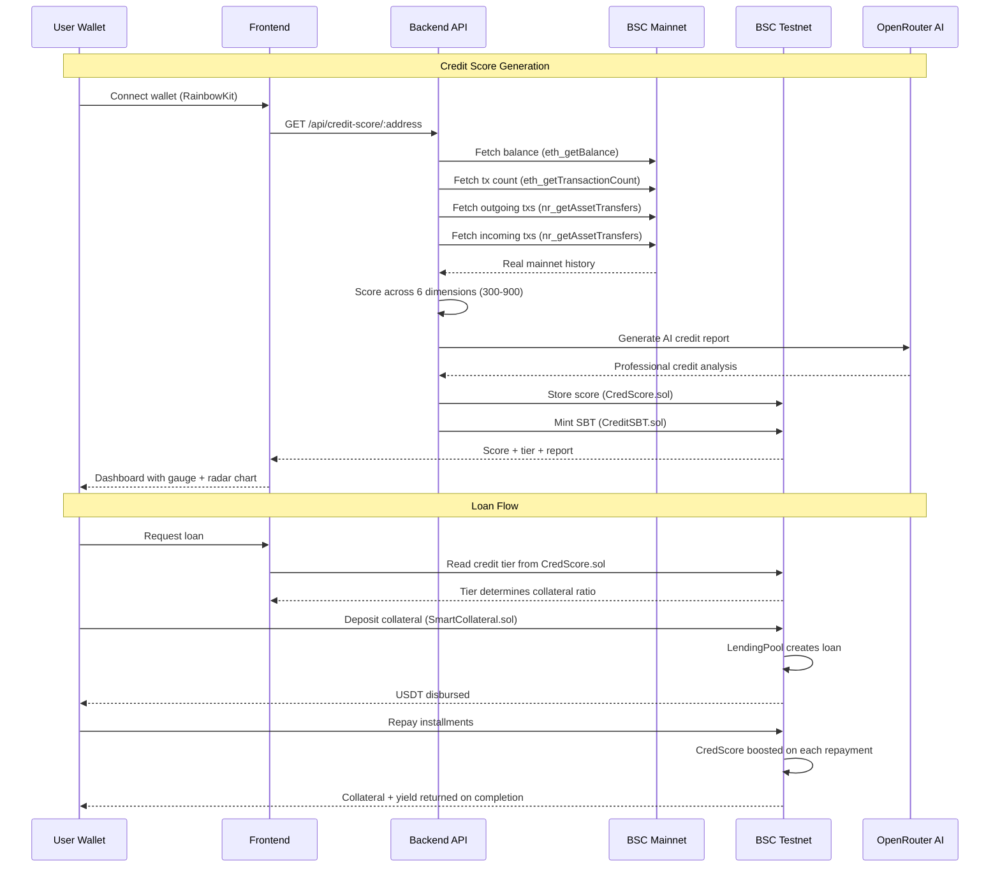
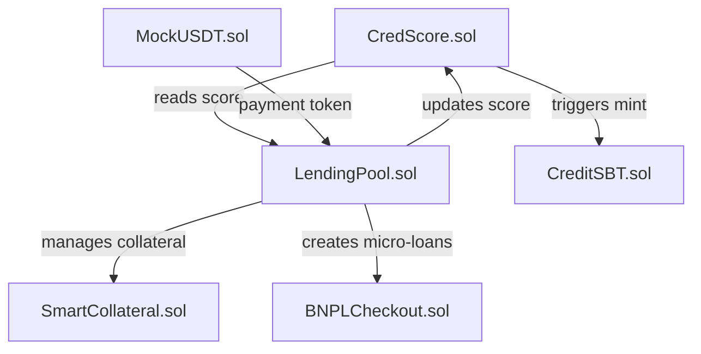
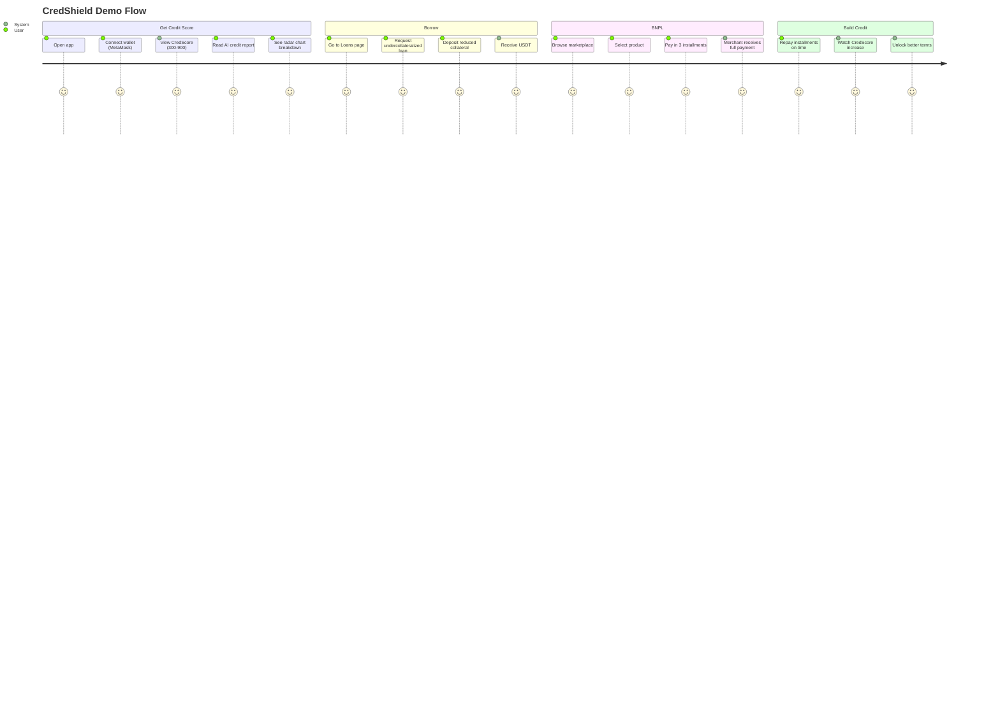

# CredShield — Technical Architecture, Setup & Demo

## 1. Architecture

### System Overview

CredShield is a three-layer protocol: **Frontend** (Next.js 15) communicates with a **Backend** (Hono API) that reads real transaction history from **BSC Mainnet** and executes lending operations on **BSC Testnet**.



### Data Flow



### On-Chain vs Off-Chain

| Component | Location | Why |
|-----------|----------|-----|
| Transaction history analysis | BSC Mainnet (read-only) | Real user data for credit scoring |
| AI credit report generation | Off-chain (OpenRouter API) | AI model inference |
| 6-dimension scoring algorithm | Off-chain (Backend) | Complex computation not suited for on-chain |
| Credit score storage | BSC Testnet (CredScore.sol) | On-chain verifiability |
| Soulbound token | BSC Testnet (CreditSBT.sol) | Non-transferable on-chain reputation |
| Lending operations | BSC Testnet (LendingPool.sol) | Trustless collateral management |
| Collateral + yield | BSC Testnet (SmartCollateral.sol) | Transparent yield tracking |
| BNPL payments | BSC Testnet (BNPLCheckout.sol) | Automated installment management |

### Smart Contract Relationships



### Security

1. **Credit score manipulation** — Only authorized contracts (LendingPool) can update scores via `onlyAuthorized` modifier
2. **Soulbound enforcement** — CreditSBT overrides `_update()` to block all transfers except mint/burn
3. **Collateral safety** — Only LendingPool can trigger collateral seizure via `onlyLendingPool` modifier
4. **One loan per user** — LendingPool enforces single active loan to prevent over-borrowing
5. **Score bounds** — Hardcoded 300-900 range prevents overflow/underflow
6. **Mainnet/Testnet separation** — Credit analysis reads mainnet data (read-only); no mainnet funds are ever touched

---

## 2. Setup & Run

### Prerequisites

- **Node.js 18+** (tested with Node 23)
- **MetaMask** or any Web3 wallet
- **BSC Testnet tBNB** — get from [BSC Testnet Faucet](https://www.bnbchain.org/en/testnet-faucet)
- **OpenRouter API Key** — get from [openrouter.ai](https://openrouter.ai) (for AI credit reports)

### Environment Setup

```bash
# Clone the repository
git clone https://github.com/YOUR_USERNAME/credshield.git
cd credshield

# Root — contract dependencies
npm install

# Backend
cd backend
cp .env.example .env
# Add your OPENROUTER_API_KEY and PRIVATE_KEY to .env
npm install

# Frontend
cd ../frontend
npm install
```

### Environment Variables

**backend/.env.example:**
```
OPENROUTER_API_KEY=           # OpenRouter API key for AI reports
PORT=3001                     # Backend API port
BSCSCAN_API_KEY=              # Optional: BSCScan API key
BSC_TESTNET_RPC=https://data-seed-prebsc-1-s1.bnbchain.org:8545
PRIVATE_KEY=                  # Deployer wallet private key

# Contract addresses (already deployed — see bsc.address)
CREDSCORE_ADDRESS=0x6aB8B76ab4a7db790F64adE917e8029F6515e076
LENDING_POOL_ADDRESS=0x73bebEd5658B3d6d2f341035e9aA0124C7AB3f2c
SMART_COLLATERAL_ADDRESS=0xaAdc99b3928898D692C59f165f6f5D3D9605affF
CREDIT_SBT_ADDRESS=0xAAA1930451fDA7c569E844a6CbE93D2B793d8103
BNPL_CHECKOUT_ADDRESS=0xE0CF917AA5463d29158EcE406BeD6D9D8EC16af8
STABLECOIN_ADDRESS=0xf10BDa04E2a5ff41329Edc0d9BA8a7e52956A27D
```

### Run

```bash
# Option 1: Docker (recommended for judges)
docker-compose up

# Option 2: Manual
# Terminal 1 — Backend
cd backend && npm run dev    # Runs on http://localhost:3001

# Terminal 2 — Frontend
cd frontend && npm run dev   # Runs on http://localhost:3000
```

### Run Tests

```bash
# Smart contract tests (35/35 passing)
npm test
```

### Verify

1. Open http://localhost:3000
2. Connect MetaMask (switch to BSC Testnet — Chain ID 97)
3. Credit score should load automatically from your real BSC mainnet history
4. Check backend logs for real-time scoring output

---

## 3. Demo Guide

### Access

- **Frontend**: http://localhost:3000 (or deployed URL)
- **Backend API**: http://localhost:3001
- **Contracts**: BSC Testnet (see `bsc.address` in repo root)

### User Flow



### Key Actions to Try

1. **Get your credit score** — Connect any wallet that has BSC mainnet history. The scoring engine analyzes real transactions.
2. **Explore the radar chart** — See how your score breaks down across 6 dimensions (Wallet Maturity, DeFi Experience, Transaction Quality, Asset Health, Repayment History, Social Verification)
3. **Read the AI report** — AI generates a personalized credit analysis explaining your score
4. **Browse BNPL marketplace** — 8 products across categories with "Pay in 3" option
5. **Check lender dashboard** — Pool stats, APY chart, deposit/withdraw interface

### Expected Outcomes

| Action | Expected Result |
|--------|----------------|
| Connect fresh wallet | Score ~300-400 (Bronze tier), minimal activity detected |
| Connect active DeFi wallet | Score 500-700+ (Silver/Gold), strong dimension scores |
| View credit report | AI-generated 3-4 paragraph analysis with specific numbers |
| BNPL checkout | 3-installment schedule created, collateral calculated at tier ratio |

### Troubleshooting

| Issue | Fix |
|-------|-----|
| "Wrong network" error | Switch MetaMask to BSC Testnet (Chain ID 97, RPC: `https://data-seed-prebsc-1-s1.bnbchain.org:8545`) |
| Score is 300 | Wallet has no BSC mainnet history — try with an active wallet |
| AI report says "fallback" | Check `OPENROUTER_API_KEY` in backend/.env |
| "Insufficient tBNB" | Get testnet BNB from [BSC Faucet](https://www.bnbchain.org/en/testnet-faucet) |
